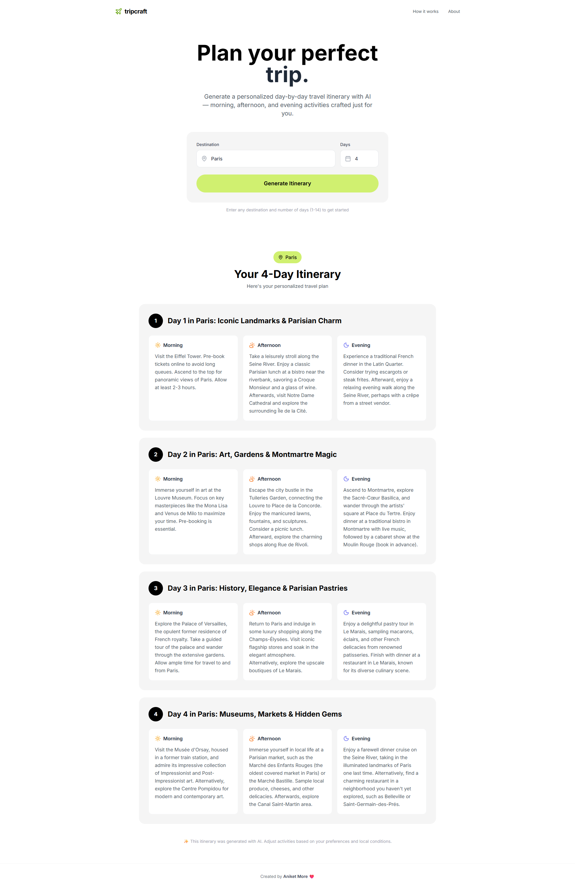
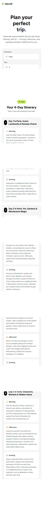

# TripCraft ✈️

An AI-powered travel itinerary generator that creates personalized day-by-day travel plans with morning, afternoon, and evening activities.

## 📸 Screenshots

| Desktop | Mobile |
|---------|--------|
|  |  |

## ✨ Features

- **AI-Powered Itineraries** — Generate detailed travel plans using Google Gemini AI
- **Day-by-Day Planning** — Morning, afternoon, and evening activities for each day
- **Mock Mode** — Works without API key using sample data for demos
- **Beautiful UI** — Clean, minimal design with lime green accents
- **Responsive** — Works on desktop and mobile devices

## 🚀 Quick Start

### Prerequisites
- Node.js (v18 or higher)

### Installation

```bash
# Clone the repository
git clone https://github.com/yourusername/travel-itinerary-generator.git

# Navigate to project
cd travel-itinerary-generator

# Install dependencies
npm install

# Start development server
npm run dev
```

The app will open at `http://localhost:5173`

## 🔑 Enable AI Mode

By default, the app runs in **Demo Mode** with sample data.

To enable real AI generation:

1. Get a free API key from [Google AI Studio](https://aistudio.google.com/apikey)
2. Create a `.env` file in the project root:
   ```
   VITE_GEMINI_API_KEY=your_api_key_here
   ```
3. Restart the development server

## 🛠️ Tech Stack

- **React** (Vite)
- **Tailwind CSS**
- **Google Gemini AI** (`@google/generative-ai`)
- **Lucide React** (icons)

## 📁 Project Structure

```
src/
├── components/
│   ├── Hero.jsx          # Input form section
│   └── ItineraryResult.jsx  # Day cards display
├── utils/
│   └── mockData.js       # Demo mode data
├── App.jsx               # Main app + pages
└── index.css             # Tailwind + custom styles
```

## 📄 License

MIT License — feel free to use this project for your portfolio!

---

Created by **Aniket More** ❤️
